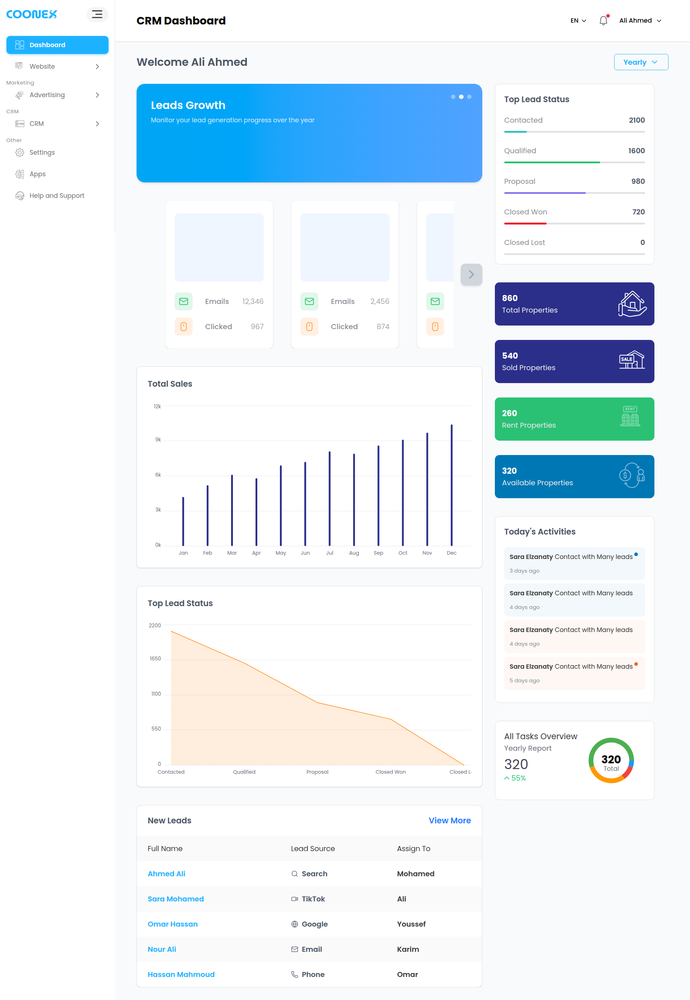
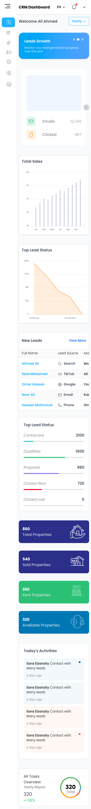

# Coonex Dashboard

> A modern, responsive analytics dashboard built with Next.js 16 and React 19 — designed for clarity, speed, and scale.

---

## Overview

Coonex is a production-ready business analytics dashboard that consolidates key metrics into a single, intuitive interface. It features interactive data visualizations, multi-language support, and a polished UI built on the latest React ecosystem. Designed with scalability in mind, the project follows a feature-sliced architecture to keep concerns cleanly separated.

---

## Features

- 📊 **Interactive Charts** — Dynamic data visualizations powered by Recharts
- 🌍 **Internationalization** — Multi-locale routing via `next-intl`
- 📱 **Fully Responsive** — Optimized layouts for desktop, tablet, and mobile
- ⚡ **React 19 + Next.js 16** — Built on the cutting-edge React and Next.js releases
- 🧩 **Component Library** — Reusable UI primitives via shadcn/ui and Base UI
- 🗂 **Feature-Sliced Architecture** — Scalable folder structure with clear separation of concerns
- 🔠 **Type-Safe** — End-to-end TypeScript coverage

---

## Tech Stack

| Category       | Technologies                                                                                  |
| -------------- | --------------------------------------------------------------------------------------------- |
| **Framework**  | [Next.js 16](https://nextjs.org), [React 19](https://react.dev)                               |
| **Language**   | [TypeScript 5](https://www.typescriptlang.org)                                                |
| **Styling**    | [Tailwind CSS v4](https://tailwindcss.com), tw-animate-css                                    |
| **UI Library** | [shadcn/ui](https://ui.shadcn.com), [Base UI](https://base-ui.com), Lucide React, Remix Icons |
| **Charts**     | [Recharts](https://recharts.org)                                                              |
| **i18n**       | [next-intl](https://next-intl-docs.vercel.app)                                                |
| **Utilities**  | clsx, tailwind-merge, class-variance-authority, date-fns                                      |
| **Carousel**   | Embla Carousel                                                                                |
| **Linting**    | ESLint 9, eslint-config-next                                                                  |

---

## Getting Started

### Prerequisites

- **Node.js** ≥ 18.x
- **npm** ≥ 9.x

### Installation

```bash
# 1. Clone the repository
git clone https://github.com/Mahmoudramadan21/coonex.git
cd coonex

# 2. Install dependencies
npm install

# 3. Start the development server
npm run dev
```

Open [http://localhost:3000](http://localhost:3000) in your browser.

### Available Scripts

| Command         | Description                        |
| --------------- | ---------------------------------- |
| `npm run dev`   | Start the local development server |
| `npm run build` | Build the production bundle        |
| `npm run start` | Run the production server          |
| `npm run lint`  | Run ESLint across the codebase     |

---

## Usage

Once the development server is running:

1. Navigate to the **Dashboard** page at `/[locale]/dashboard` (e.g. `/en/dashboard`).
2. Browse the metric cards, charts, and summary panels.
3. Use the **theme toggle** in the header to switch between light and dark modes.
4. Switch locales via the language selector to test the internationalization support.

---

## Project Structure

```
coonex/
├── src/
│   ├── app/
│   │   └── [locale]/
│   │       └── dashboard/       # Dashboard pages & layout
│   ├── features/
│   │   └── dashboard/           # Dashboard feature module (components, logic)
│   ├── shared/
│   │   ├── components/          # Shared UI components
│   │   ├── hooks/               # Shared custom hooks
│   │   └── lib/                 # Utility functions & helpers
│   ├── assets/                  # SVGs, images, and static assets
│   ├── i18n/                    # next-intl configuration & routing
│   ├── messages/                # Locale translation files
│   └── proxy.ts                 # Shared module re-export proxy
├── public/                      # Static public assets
├── components.json              # shadcn/ui configuration
├── next.config.ts               # Next.js configuration
├── tailwind.config.ts           # Tailwind CSS configuration
├── tsconfig.json                # TypeScript configuration
└── package.json
```

---

## Screenshots

> ℹ️ Add your screenshots to `public/screenshots/` and update the paths below.

| Dashboard Overview                                       | Responsive View                                 | Lighthouse Score                                              |
| -------------------------------------------------------- | ----------------------------------------------- | ------------------------------------------------------------- |
|  |  | [Lighthouse Score](./public/screenshots/lighthouse-score.png) |

---

---

<p align="center">Built with ❤️ using Next.js & React</p>
